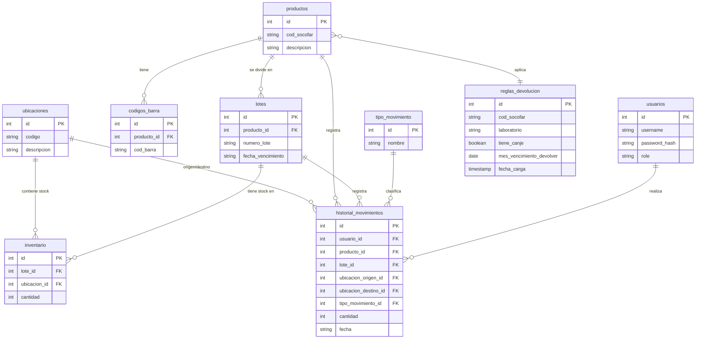

# MyERPharma 📦💊 — Gestión de Inventario, Caducidades y Logística Inversa

MyERPharma es una solución web monolítica profesional y responsiva diseñada para el control riguroso de inventario farmacéutico. A diferencia de los sistemas de inventario genéricos, MyERPharma está optimizado para los flujos de trabajo críticos de las farmacias, permitiendo el seguimiento físico por lotes, múltiples códigos de barras por producto, la trazabilidad a través de ubicaciones físicas y la automatización del proceso de **Logística Inversa** (devoluciones y canjes con laboratorios).

---

## 🚀 Características Clave

### 1. Gestión de Stock por Lotes y Ubicaciones

- **Trazabilidad total:** Permite almacenar el mismo producto en múltiples ubicaciones físicas con diferentes números de lote y fechas de vencimiento.
- **Movimientos de inventario seguros:** Entradas, salidas y traslados físicos gestionados bajo transacciones seguras de base de datos.
- **Prevención de inconsistencias:** Los traslados de stock son operaciones atómicas (`FOR UPDATE`) que evitan condiciones de carrera (_race conditions_) y garantizan que no haya stock negativo.

### 2. Módulo de Logística Inversa (Gestión de Canjes)

- **Procesador de Matrices de Canjes:** Importación dinámica de archivos CSV con las políticas mensuales de devoluciones de los laboratorios. El script realiza la limpieza de BOM, codificaciones (soporta ISO-8859-1 y UTF-8) y detecta delimitadores y cabeceras automáticamente.
- **Actualizaciones sin Downtime:** La carga de canjes emplea un mecanismo de _swap_ atómico en MySQL (`RENAME TABLE`), garantizando consistencia total del sistema durante la importación.
- **Alertas Inteligentes de Vencimiento:** El sistema cruza el inventario activo con las reglas cargadas para alertar si un lote califica para "Canje Habilitado" (devolución al laboratorio) o si debe ser clasificado como "Sin Canje (Baja)". Si un producto no está en la matriz, aplica la política estándar de alerta preventiva de 3 meses.

### 3. Entrada de Datos de Alto Rendimiento (Escáner de Código de Barras)

- **Integración de Lector de Códigos de Barras Físico:** Cuenta con un oyente de eventos de teclado global en JS optimizado para lecturas ultrarrápidas de escáneres.
- **Prevención de Errores de Entrada:** Bloquea el comportamiento por defecto de la tecla `Enter` en los inputs de búsqueda para evitar el envío accidental de formularios inconclusos.
- **Audio-Feedback en Tiempo Real:** Utiliza la API de Audio de Web (Web Audio API) para emitir señales auditivas diferenciadas (pitido corto de éxito y doble tono grave para alertas o errores), mejorando la velocidad de operación del operario en bodega.

### 4. Seguridad de Grado Militar y Respaldo Failsafe

- **Redundancia de Caja Negra:** Cada movimiento físico de stock (Entradas, Salidas y Traslados) se registra simultáneamente en la base de datos y en un log inalterable en disco local (`backups/kardex.jsonl`), blindado de accesos externos mediante reglas `.htaccess`.
- **Respaldos Cifrados AES-256:** Permite a los administradores descargar copias de seguridad completas. La aplicación genera un volcado SQL estructurado en bloques (_chunks_ de 500 registros para evitar el desbordamiento de memoria en hostings compartidos), comprime el archivo junto al log secuencial en un ZIP y lo cifra mediante **AES-256-CBC** de manera simétrica, sirviendo un archivo seguro `.zip.enc`.
- **Políticas de Autenticación Rigurosas:** Sesiones PHP seguras (`httponly`, `use_strict_mode` y `secure` en producción), regeneración de ID de sesión para evitar _Session Fixation_, protección integrada contra fuerza bruta (bloqueo automático de 30 segundos tras 5 intentos fallidos) y un interceptor de peticiones Fetch para validar tokens CSRF (`X-CSRF-Token`) en todas las solicitudes de modificación.

---

## 🛠️ Arquitectura y Stack Tecnológico

El proyecto está diseñado bajo la filosofía **KISS** (Keep It Simple, Stupid) y **SOLID**, priorizando la legibilidad, mantenibilidad y el rendimiento óptimo en servidores de recursos limitados (ej. Hosting Compartido como InfinityFree).

- **Backend:** PHP (Monolito Modular / Modulith). Arquitectura desacoplada bajo principios SOLID en capas de Servicios (lógica de negocio pura y agnóstica) y Repositorios (persistencia relacional InnoDB) para garantizar alta mantenibilidad y baja complejidad ciclomática.
- **Base de Datos:** MySQL (Esquema completamente normalizado e indexado).
- **Frontend:**
  - **HTML5 & CSS3 Vanilla:** Sistema de diseño moderno desarrollado mediante variables CSS (`:root`), Grid, Flexbox y animaciones personalizadas sin dependencias ni sobrecarga de frameworks como Tailwind.
  - **Vanilla JS (ES6+):** Enrutador del lado del cliente (Single Page Application - SPA) que interactúa con la API RESTful interna mediante llamadas asíncronas con la API Fetch.
- **Diseño Visual:** Estética premium, dark sidebar con detalles en índigo y slate, diseño mobile-first y soporte de tarjetas expansivas al tacto para optimizar el espacio de las tablas de datos en pantallas de celulares.

---

## 📂 Estructura del Proyecto

```bash
MyERPharma/
├── api/                       # API RESTful interna (Retorna exclusivamente JSON)
│   ├── backup.php             # Genera y cifra el respaldo del sistema (AES-256)
│   ├── canjes_upload.php      # Procesa la subida y swap de la matriz de canjes (.csv)
│   ├── changelog_upload.php   # Sube y valida notas de versión (.json)
│   ├── consulta_reglas.php    # Búsqueda de reglas de devolución de productos
│   ├── dashboard.php          # Estadísticas del panel de control
│   ├── estado_matriz.php      # Valida la antigüedad de la matriz de canjes
│   ├── historial.php          # Consulta e historial detallado del Kardex
│   ├── inventario.php         # Transacciones físicas (Entrada, Salida, Traslado)
│   ├── perfil.php             # Cambios de contraseñas de usuarios
│   ├── productos.php          # Búsqueda y gestión en el maestro de productos
│   ├── reportes_canjes.php    # Reporte inteligente de vencimientos y logística inversa
│   ├── ubicaciones.php        # Gestión de ubicaciones físicas en bodega
│   └── update_version.php     # Modificación del archivo de versión
├── assets/                    # Notas de versión (release_note.json) y recursos
├── backups/                   # Directorio protegido (.htaccess) de logs y respaldos locales
├── css/
│   └── style.css              # Sistema de diseño, variables CSS y estilos premium
├── datos pruebas/             # Datos semilla y esquema SQL
│   └── database_schema_and_seed.sql
├── includes/                  # Lógica compartida del core e infraestructura
│   ├── HistorialRepository.php # Capa de persistencia y consultas de Kardex
│   ├── InventarioRepository.php # Operaciones y transacciones de persistencia de stock
│   ├── InventarioService.php    # Lógica de negocio para movimientos de inventario
│   ├── PerfilRepository.php     # Persistencia y actualización de credenciales de usuario
│   ├── PerfilService.php        # Lógica de negocio y validación de perfiles
│   ├── auth.php               # Control de seguridad, sesiones, intentos fallidos y CSRF
│   ├── db.php                 # Conexión PDO Singleton (conmutación automática Local/Prod)
│   └── version.php            # Archivo que almacena la versión actual del sistema
├── js/                        # Controladores de UI y SPA por módulos
│   ├── app.js                 # App Shell, interceptor CSRF, Router y Oyente del escáner
│   ├── dashboard.js           # Lógica visual del panel de control
│   ├── inventario.js          # Control de stock y consultas de inventario
│   ├── movimientos.js         # Interfaz para Entradas, Salidas y Traslados
│   ├── logistica.js           # Subida de CSV y visualización del reporte de canjes
│   ├── changelog.js           # Visualizador e importador de release notes
│   ├── productos.js           # Interfaz de maestro de productos
│   ├── ubicaciones.js         # Interfaz de gestión de ubicaciones
│   └── perfil.js              # Interfaz de configuración de perfil
├── index.php                  # Punto de entrada principal y App Shell
├── login.php                  # Pantalla de inicio de sesión segura y responsiva
├── logout.php                 # Cierre de sesión y destrucción de sesión segura
└── test_func.php              # Pruebas internas de funcionalidad
```

---

## 🗄️ Modelo de Datos

El esquema se divide en 9 tablas relacionales principales que garantizan la integridad referencial:



---

## 🔧 Instalación y Configuración

### Requisitos del Sistema

- Servidor web (Apache / Nginx) con PHP 8.1 o superior.
- Servidor de base de datos MySQL 5.7 o superior.
- Habilitar extensiones PHP: `PDO_MySQL`, `openssl`, `zip`, `mbstring`.

### Pasos para el Despliegue Local

1.  **Clonar el repositorio** en la carpeta pública de tu servidor web:
    ```bash
    git clone https://github.com/tu-usuario/MyERPharma.git
    ```
2.  **Configurar la Base de Datos:**
    - Crea una base de datos en tu servidor MySQL (ej. `myerpharma`).
    - Importa el esquema inicial y los datos semilla desde:
      `datos pruebas/database_schema_and_seed.sql`.
3.  **Configurar credenciales de conexión:**
    - Edita el archivo [includes/db.php](file:///Users/cristian/Desarrollo/MyERPharma/includes/db.php). El script cuenta con detección inteligente de entornos. Modifica las credenciales de la sección `isLocal` según tu configuración local:
      ```php
      if ($isLocal) {
          define('DB_HOST',    'localhost');
          define('DB_NAME',    'myerpharma');
          define('DB_USER',    'root');
          define('DB_PASS',    'tu_contraseña');
      }
      ```
4.  **Iniciar Servidor de Desarrollo:**
    Si utilizas la CLI de PHP:
    ```bash
    php -S localhost:8000
    ```
    Abre en tu navegador: `http://localhost:8000`.

---

## 🧪 Gobernanza de Calidad Estática

El proyecto implementa un arnés de control estático local mediante **PHPMD** (PHP Mess Detector) y **PHPCPD** (PHP Copy-Paste Detector) para garantizar la limpieza, legibilidad e integridad de la base de código. Se configuran reglas de auditoría continua basadas en límites estrictos:
- **Complejidad Ciclomática Máxima:** 10 por método o función.
- **Complejidad NPath Máxima:** 200 por método o función.
- **Duplicidad de Código:** Umbral del 0% de código duplicado en la capa de la API y componentes (DRY).

Para ejecutar los análisis estáticos de calidad localmente:
```bash
# Auditar reglas de tamaño de código y variables no utilizadas
vendor/bin/phpmd api,includes text unusedcode,codesize

# Auditar duplicidad de código
vendor/bin/phpcpd api includes
```

---

## 🛡️ Convenciones de Desarrollo

Este proyecto sigue estándares rígidos para asegurar que el código sea comprensible por cualquier desarrollador en el futuro:

- **Clean Code:** Nombres descriptivos y funciones pequeñas de responsabilidad única.
- **Comentarios en Español:** Explicar el _por qué_ se toma una decisión técnica y no solo el _qué_ hace el bloque de código.
- **Evitar Acoplamientos Ocultos:** Mantener el backend (API JSON) completamente desacoplado de la lógica visual del frontend, sirviendo solo datos puros.
- **Políticas de Estilos:** Se prohíbe el uso de frameworks CSS externos. Todo ajuste estético debe realizarse bajo las variables del tema de CSS nativo definidas en el archivo [css/style.css](file:///Users/cristian/Desarrollo/MyERPharma/css/style.css).

---

## 📝 Licencia

Este proyecto está bajo la Licencia MIT. Consulta el archivo `LICENSE` para más detalles.
